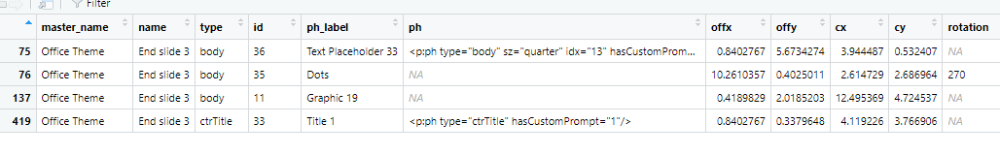
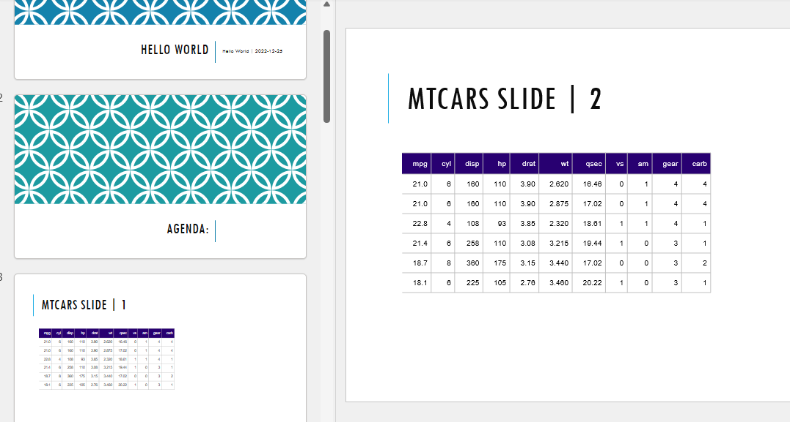

```{r setup, include=FALSE}
knitr::opts_chunk$set(echo = TRUE)
```

## Set up jira api

I used `httr` and `tidyverse` in order to build connection to API.

1.  Install packages

2.  Go to **Profile --\> Personal Access Tokens --\> Click 'Create Tonken'**

3.  Set-up name and expiry. Then you will prompt to token menu.

4.  Copy it, it looks like `NjYxAzUwQDc4OTYxOnky9adqxCFOjANZMWAAG1QiEEBj`

5.  The copy token in the script:

    ```{r}
    # Set the base URL for the Jira API
    base_url <- "link_to_jira/rest/api/2/"

    # Set the authentication token and the header for the request
    auth_token <- "NjYxAzUwQDc4OTYxOnky9adqxCFOjANZMWAAG1QiEEBj"
    headers <- c("Authorization" = paste0("Bearer ", auth_token))

    # Set the parameters for the request
    project <- c("Jira", "Robot")
    status <- c("Open", '"In Progress"', "Reopened")
    customer <- "Jira-R"

    # Make the request to the Jira API
    response <- GET(paste0(base_url, "search"),
                    query = list(jql = paste0("project in (", paste(project, collapse = ","), 
                                              ") AND status in (", paste(status, collapse = ", "), 
                                              ") AND Customer = '", customer, " /'")),
                    add_headers(headers))

    # Check the status code of the response
    if (response$status_code != 200) {
      stop("Error: request to Jira API failed")
    }

    # Extract the data from the response
    data <- content(response)
    ```

6.  In data you will see the structure as list. In my case it returns the list of opened issues for customer **Jira-R.**

7.  The i made a list with data and source additional info with function `GET`

    ```{r}
    issues <- list()
    for (issue in data$issues) {
      key <- issue$key
      fields <- issue$fields
      
      issues[[key]]$id <-key
      issues[[key]]$assignee <- fields$assignee$displayName
      issues[[key]]$over <- fields$customfield_10041
      issues[[key]]$waitfor <- fields$customfield_10029$value
      issues[[key]]$total <- fields$customfield_10040
      issues[[key]]$summary <-  fields$summary
      issues[[key]]$area <- fields$customfield_16000$value
      issues[[key]]$link_to_comments <- issue$self
      issues[[key]]$last_update <- fields$updated
      issues[[key]]$due_date <- issue$field$duedate
      issues[[key]]$issue_comments <- content(
        GET(
          issues[[key]]$link_to_comments, add_headers(headers)
        )
      )$fields$comment$comments
      
      issues[[key]]$last_comment <-  issues[[key]]$issue_comments[length(issues[[key]]$issue_comments)]
      if(length(issues[[key]]$last_comment)!=0) {
        
        issues[[key]]$author <- issues[[key]]$last_comment[[1]]$author$displayName
        
        issues[[key]]$last_comment_body <- issues[[key]]$last_comment[[1]]$body
      } else {
        issues[[key]]$author <- NA
        issues[[key]]$last_comment_body <- NA
      }
    }
    ```

8.  It is easy to parse **JIRA API** with Chrome extension **JSON Formatter.** So you can open the link with details in `issue$self` (for example [https://your_jira_link/rest/api/2/issue/699342](https://jour_jira_link/rest/api/2/issue/699342){.uri}) in Browser and there just look on formatted JSON or with DevTools look at Jira issue page and find the field you need to store.

## Create PPTX (power point slides with issues)

1.  Create an empty **template.pptx** or whatever you call it.

2.  Open it --\> go to slider master and adjust style you need.

3.  Sometimes script might fall with error such as **cannot find Title and Content for slide master named Office Theme.**

    1.  So there go to your template, open slide master and check that the slide master named as **Office Theme (first slide i slide master).** Right click and 'Rename Master' then see if name was fine, also check that you have slide with name 'Title and Content' or any it errors.

4.  Then you install package `flextable` and can create a table which fit to slide.

5.  The code how to create presentation:

    ```{r}
    # load template
    pres_new <- read_pptx(path = "template.pptx") %>%
      #take the slide named Title slide 1 from slide master name
      add_slide(layout = "Title slide 1") %>%
      # add title with location type
      ph_with(value = customer
              , location = ph_location_type(type = "ctrTitle")) %>%
      # add content to another place holder
      ph_with(value = paste0("Bi-weekly meeting | ",Sys.Date()) 
              , location = ph_location_type(type = "subTitle")) %>%
     # do the same as above, e.g. take the slide with name Agenda 2
       add_slide(layout = "Agenda 2") %>%
      ph_with(value = "Agenda:", 
              location = ph_location_type(type = "title")) %>%
      ph_with(value = c(names(issues),"Open questions"),
              location = ph_location_label(ph_label = "Text Placeholder 7")) 

    # for each issue create separate slide with table of data and modifies table to fit slides
    for (issue in issues) {
      
      df1 <- data.frame(ID = issue$id,
                       Assignee = issue$assignee,
                       "Wait for" = issue$waitfor,
                       "Last update" = as.Date(substr(issue$last_update, 1, 10) ),
                       Overdue = issue$over,
                       "Due date" = as.Date(substr(issue$due_date, 1, 10)))
      
      names(df1) <- c("ID","Assignee", "Wait for", "Last Update", "Overdue", "Due date")
      df <-  autofit(flextable(df1)) %>%
        bg(bg = "#280071", part = "header") %>%
        color(color = "white", part = "header") %>% 
        hline_top(part = "all", border = fp_border(color ="grey")) %>%
        hline_bottom(part = "all", border = fp_border(color ="grey")) %>%
        vline(border = fp_border(color = "grey")) %>%
        hline(border = fp_border(color = "grey"), part = "all") 

      # create url
      df <- compose(x = df, j = "ID", value =  as_paragraph(hyperlink_text(x = ID, url = paste0("link_to_your_jira/browse/",ID) )))

      pres_new <- pres_new %>%
        add_slide() %>%
        ph_with(value = paste0(issue$id, " | ", issue$summary)
                               , location = ph_location_type(type = "title")) %>%
        ph_with(value = df, location = ph_location_label(ph_label = "Content Placeholder 2")) %>%
        ph_with(value = "", location = ph_location_label(ph_label = "Content Placeholder 10") )
      
    }
    # add left slides with the same way.
    pres_new <- pres_new %>%
      add_slide(layout = "One content 2") %>%
      ph_with(value = "Open Questions: "
              , location = ph_location_type(type = "title")) %>%
      ph_with(value = "", location = ph_location_label(ph_label = "Content Placeholder 2")) %>%
      add_slide(layout = "End slide 3") %>% 
      ph_with(value = "Thank you!",
              location = ph_location_label(ph_label ="Title 1")) %>%
      ph_with(value = paste0(Sys.Date()), 
              location = ph_location_label(ph_label = "Text Placeholder 33"))
    # save as file
    print(pres_new, target = "test.pptx")
    ```

6.  To see the content of slide master you can use this function:

    ```{r}
    # to see full content of your slide master
    layout_summary(read_pptx(path = "template.pptx"))
    # to see place holder labels and type for particular slide
    layout_properties(pres_new, layout = "slide name from slide master")
    ```

7.  So you will have table such as:

    **ph_label** - uses with location `ph_location_label()` **type** - uses with location `ph_location_type()`

    but since there is could be several Place holders with same type, better to you **ph_label** as it is unique

    

8.  Play around with different place holdes and your content so to do really good automated PPTX with R.

9.  Example ( I created pptx with head of data Mtcars)\
    
